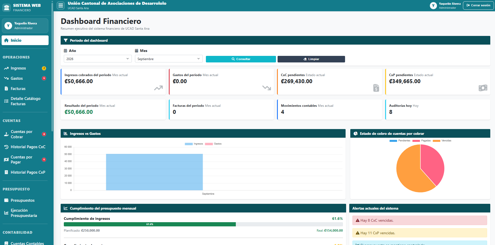
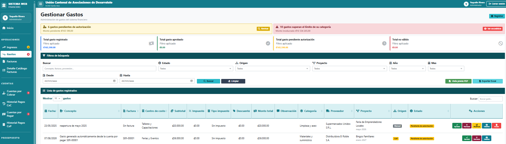
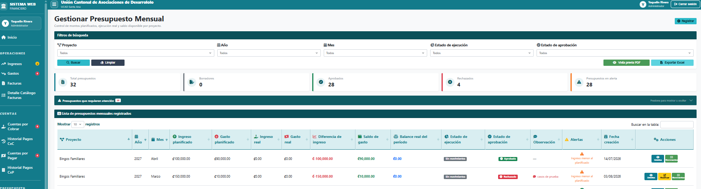
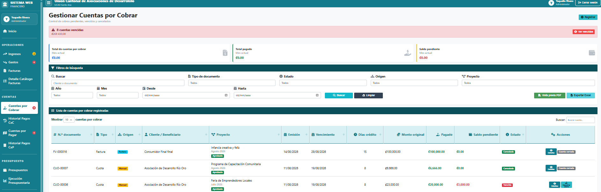
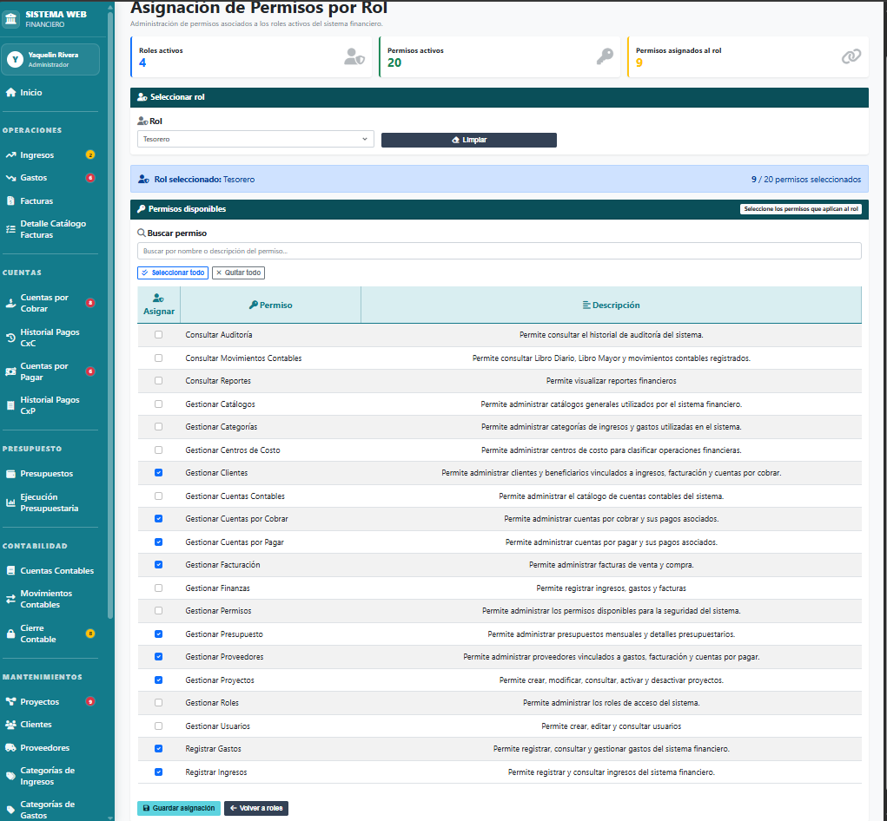

# Financial Management System

Web-based financial management system developed as a **Bachelor's Degree graduation project in Software Engineering**.

The application centralizes financial and accounting operations, providing tools to manage income, expenses, invoices, accounts receivable, accounts payable, budgets, accounting movements, projects, users, roles, permissions, and audit records.

## Technologies

- C#
- ASP.NET Core MVC
- Entity Framework Core
- SQL Server
- Razor Views
- HTML5
- CSS3
- Bootstrap
- JavaScript
- jQuery
- SweetAlert
- Visual Studio

## Main Features

### Financial Management

- Income management
- Expense management
- Invoice management
- Accounts receivable
- Accounts payable
- Payment tracking
- Budget management
- Accounting movements
- Monthly accounting closing

### Administrative Management

- Customers and beneficiaries
- Suppliers
- Projects
- Cost centers
- Accounting accounts
- Expense categories
- Income categories

### Security and Access Control

- User authentication
- Role management
- Permission management
- Role-based access control
- Audit trail for system operations

### Reporting

- Financial reports
- Budget reports
- Accounts receivable reports
- Accounts payable reports
- Income and expense reports
- Accounting movement reports

## Architecture

The project follows an ASP.NET Core MVC architecture and separates responsibilities into different layers:

- **Controllers** — Handle requests and application flow
- **Models** — Represent domain and database entities
- **ViewModels** — Provide data structures for the user interface
- **Repositories** — Handle data-access operations
- **Services** — Contain business logic
- **ViewComponents** — Provide reusable UI components
- **Views** — Razor-based user interface
- **Data** — Entity Framework database context and configuration

## Project Structure

```text
SistemaGestionFinanciera/
│
├── Controllers/
├── Data/
├── Models/
├── Repositories/
├── Services/
├── ViewComponents/
├── ViewModels/
├── Views/
├── wwwroot/
├── Program.cs
└── appsettings.json
```
## Configuration

For security reasons, local database credentials and development-specific settings are not included in the repository.

Create an `appsettings.Development.json` file and configure your SQL Server connection string before running the application.

## How to Run

1. Clone the repository.
2. Open `SistemaGestionFinanciera.sln` in Visual Studio.
3. Configure the SQL Server connection string in `appsettings.Development.json`.
4. Restore project dependencies.
5. Apply the required database migrations or create the database.
6. Run the application.

## Screenshots

### Financial Dashboard


### Expense Management


### Budget Management


### Accounts Receivable


### Role and Permission Management


## Academic Context

This project was developed as part of the **Bachelor's Degree in Software Engineering** graduation requirements.

It involved the design and implementation of a complete financial management system, including database modeling, backend development, business logic, security, reporting, and frontend development.
## Author

**Yaquelin Rivera Serrano**

Software Engineering | .NET Development

C# · ASP.NET Core · SQL Server

**Interests:** Cloud · Cybersecurity

LinkedIn:  
https://www.linkedin.com/in/yaquelin-rivera
